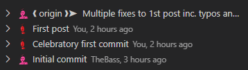

# Git - rewrite history

## Squash commits on remote

One of the things I realised very using GitHub Pages for a blog is that fixing an issue (typos, links etc.) might take a few attempts resulting in unnecessary commits. While rewriting history is not advised, it can hardly have any sour points when I'm the only contributor to this blog. As part of my ongoing approach to learn more advanced Git scenarios, I've decided to try and squash the few commits used to fix typos and links in my previous post in origin.

|                    Before                    |                   After                    |
| :------------------------------------------: | :----------------------------------------: |
|  |  |

Aside from the anxiety induced by rewriting Git history and the idea of breaking things this early on, it was pretty straight forward:

```
git rebase -i origin/main~6 main
git push origin +main
```

##### Special thanks to [this StackOverflow](https://stackoverflow.com/a/5668050)

<br/>

## Bonus find - GitLens Interactive Rebase


One interesting find is that `git rebase` triggers [Git Lens](https://marketplace.visualstudio.com/items?itemName=eamodio.gitlens) UI which made the rebase a breathe for the uninitiated like myself: change the commits to squash, start rebase, follow the prompts to update commit messages and DONE!

> If that does not pop up on its own, you can use ctrl+shift+p and search for 'GitLens: Enable Interactive Rebase Editor' to enable it

The same technique can be used on commits deep in history (i.e. does not have to include the latest commit).

###### TAGS

<GIT> <SQUASH>
