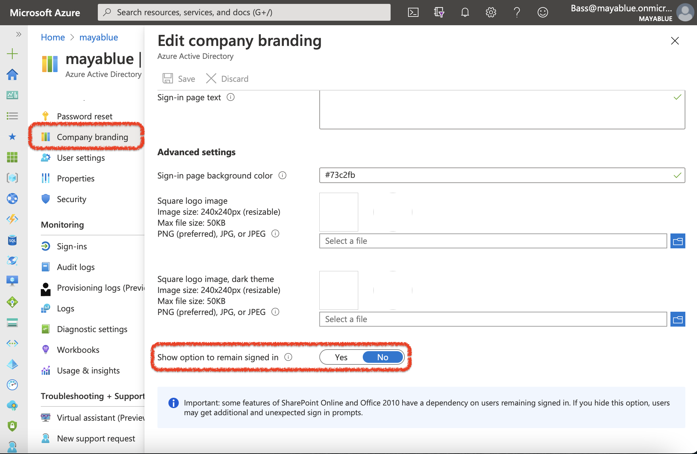

# “Stay signed in?”
## Turn off the Azure AD “Stay signed in?” page

You must have seen this one before and wondered why clicking yes never made much of a difference.
It's one of the most annoying things and for my dev environments, I now make sure to turn that off - which turned out to be pretty straight forward thanks to [Michael Neihaus here](https://oofhours.com/2020/12/17/turn-off-the-azure-ad-stay-signed-in-page/)

