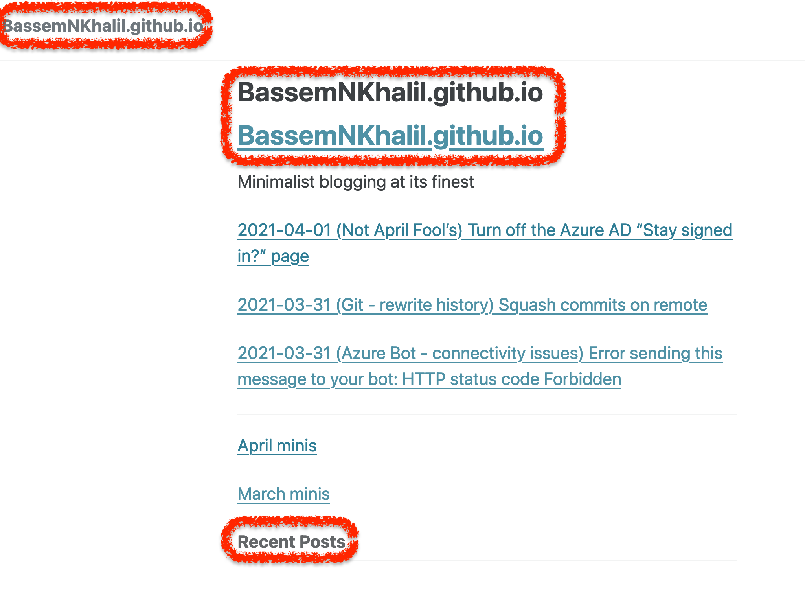

# Custom themes for Github pages
## How to link a remote theme with minimal effort

This is one that I didn't catch instinctively the first time. Basically, if you read [this](https://github.blog/2017-11-29-use-any-theme-with-github-pages/) it seems like a one liner to add - that's not the case. When I add `remote_theme: mmistakes/minimal-mistakes` to the `_config.yml` I only get an email with a Page build failure! A few searches landed me [here](https://github.blog/2017-11-29-use-any-theme-with-github-pages) suggesting it is as simple. A few searches more, I landed [here](https://github.com/mmistakes/minimal-mistakes#installation) and the installation steps seem to be a lot longer. I didn't think I needed to install anything given I don't use Jekyll itself but only host via Github Pages which uses Jekyll under the hood. I ended up with the following _config.yml
```
remote_theme: mmistakes/minimal-mistakes
plugins:
  - jekyll-include-cache
```
Here's a quick peek at the result (with the main differences highlighted)

While it seems better, there's a few things that need to be updated:

1. Different font colour
1. Figure out how to get posts under Recent Posts
1. Go back to use page width as before

At least the teal colour is a SharePoint easter egg, Happy Easter.

###### TAGS
<GitHub> <GitHubPages>
