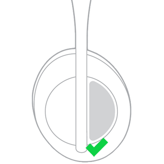
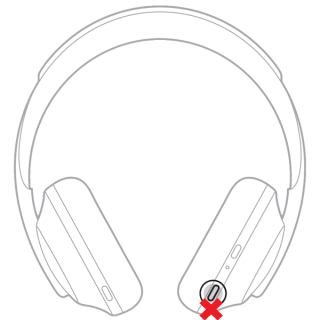

# Desk setup - Bose NC700

## How to use the mute function

For my work setup, I currently use a [Bose NC700](https://www.bose.com.au/en_au/products/headphones/noise_cancelling_headphones/noise-cancelling-headphones-700.html#v=noise_cancelling_headphones_700_luxe_silver) which I swear by for noise cancellation (even better than my [AirPods Pro](https://www.apple.com/au/shop/product/MWP22ZA/A/airpods-pro) which are my on-the-go alternative). A while ago, I started noticing some weird connectivity issues where my mouse would slow down scrolling while my headphones were connected. It wasn't my beloved headphones but actually my over-priced [Microsoft Surface Mouse](https://www.jbhifi.com.au/products/microsoft-surface-mouse)! Apparently, both connecting via bluetooth causes interference of sorts. I went through a couple different mice before accepting that I still love my Surface mouse despite the issue. To overcome, I had to upgrade my headset with [its USB link](https://www.bose.com.au/en_au/products/headphones/headphone_accessories/bose-usb-link.html#v=bose_usb_link_black) upgrading my setup to a Teams certified one and - more importantly - allowing me to use both the Bose NC700 and the Surface mouse without an issue. Because of that, the mute functionality within Teams should also work .. only it didn't.

It wasn't a lengthy struggle, a quick search led me to [this community post](https://community.bose.com/t5/Around-On-Ear-Headphones/BOSE-NC-700-UC-Teams-certified-but-still-no-mute-button/td-p/555194) mentioning mute works using the `touch controller`. Another quick search showed that the touch control is the one below (as opposed to the same mute button used for calls a.k.a Voice Assistant button)

|                      Good                       |                       Bad                       |
| :---------------------------------------------: | :---------------------------------------------: |
|  |  |

###### TAGS

<Bose> <NC700> <DeskSetup>
