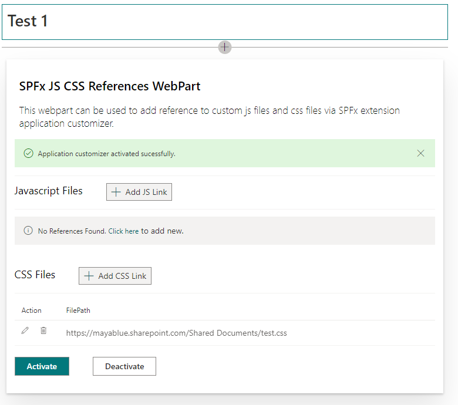
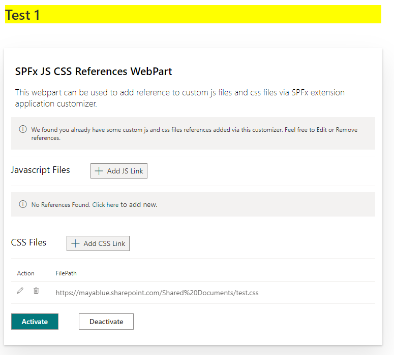

# Add CSS to modern SharePoint page

## But just because you can doesn't mean you should ..

A recurring request when starting a new SharePoint project (especially when there's previous history with on-prem SharePoint) is to embed CSS and JavaScript into a page. Below is a walk-through of how we can embed CSS (JS to follow in another post but it follows along the same lines) but before we dive into the technical details, I'd like to cover how fragile and prune to break this is (and by design) and how it is advised against.

Embedding a CSS is simple and there's many ways to do it, the problem is that CSS needs to target HTML components to work i.e. target all h2 tags (SharePoint starts from h2 which is the underlying HTML tag when selecting Heading 1 adding text to a text webpart) and change the background. This specific example would work very well but in practice, things are a bit different: usually, you'd want to target a specific subset of HTML components with your style - something like target h2 tags in the right-side column or paragraphs rendered by this specific webpart .. and this is where the issue is.

As you would probably know, this basically would work as long as the target does not change but SharePoint modern pages change structure from time to time hence the problem. If this is necessary (i.e. you need to follow enforced design guidelines as in my case), make sure all stakeholders understand that this an break from time to time depending on the kind of updates Microsoft rolls out. Also, ensure your changes can fail gracefully i.e. worst case scenario, h2 components render without the additional styling - hence why extensive styling and/or JS injection would be more problematic (imaging waking up to find your custom JS application is broken because the HTML components it depends on are not there any more).

<br/>

Now to the technical part: I first arrived at these ([Inject Custom CSS on SharePoint Modern Pages using SPFx Extensions](https://link) and [the follow-up](https://tahoeninjas.blog/2018/10/29/update-inject-custom-css-on-sharepoint-modern-pages-using-spfx-application-extensions/)) from Hugo Bernier - Tahoe Ninjas. There's also a sample from Hugo [here](https://github.com/hugoabernier/react-application-injectcss). For testing purposes, I chose to use [this sample](https://github.com/pnp/sp-dev-fx-webparts/tree/master/samples/react-add-js-css-ref) as it comes with a webpart to choose the CSS file to embed rather than having to deploy every time to test which is pretty convenient.

One thing to note is that I had to disable NoScript to be able to upload a CSS file to the site I was using - detailed [here](https://asishpadhy.com/2020/01/21/issue-fix-access-denied-to-style-library-on-sharepoint-while-uploading-images/)

```
Connect-SPOService -Url https://tenant-admin.sharepoint.com
Set-SPOSite -Identity https://tenant.sharepoint.com/sites/sitename/ -DenyAddAndCustomizePages 0
```

For production use, I plan to use a basic SharePoint extension that only includes the following lines:

```
let cssLink: HTMLLinkElement = document.createElement("link");
cssLink.href = "Path to CSS file in SharePoint";
cssLink.type = "text/css";
cssLink.rel = "stylesheet";
document.body.appendChild(cssLink);
```

This would restrict CSS to a specific file for a false sense of security.We can also structure the CSS file referenced to be a proxy of sorts and use `@import url("child.css");` to import other CSS files into the main one. Keep in mind that importing CSS files add extra HTTP calls which may affect performance in certain circumstances.

Below is a sample when applying a simple style of

```
h2 {
  background-color: yellow;
}
```

|                       Before                        |                      After                      |
| :-------------------------------------------------: | :---------------------------------------------: |
|  |  |

That's it - it's a simple DEV hack but a tricky one to use properly without causing harm. Guidance and Governance is the way!

###### TAGS

<Modern> <SharePoint> <Hack> <Workaround> <CSS>
